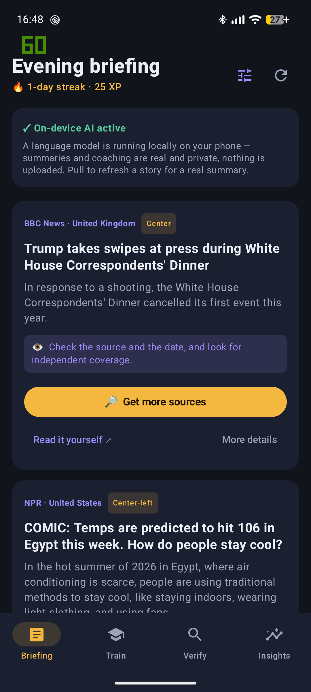
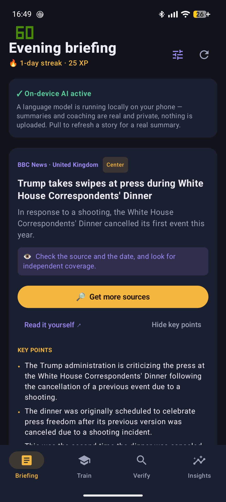
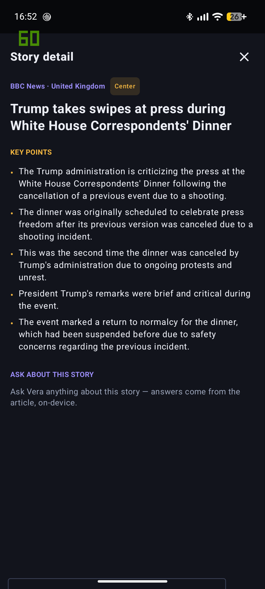
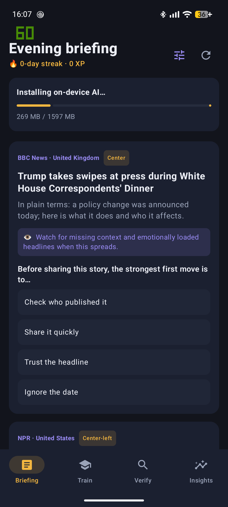
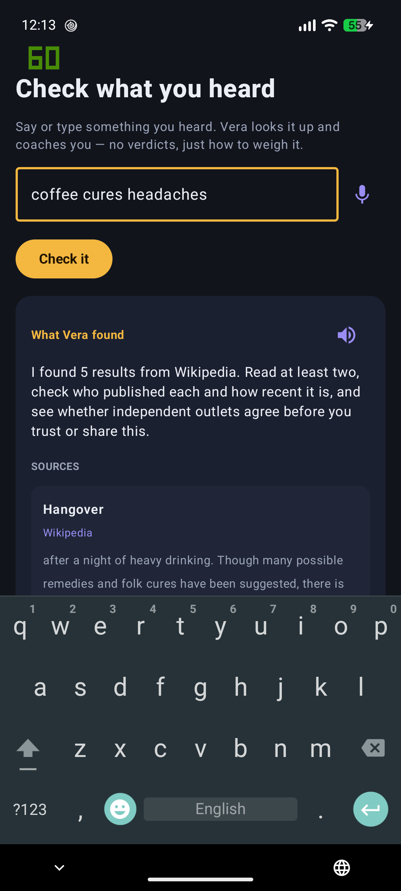
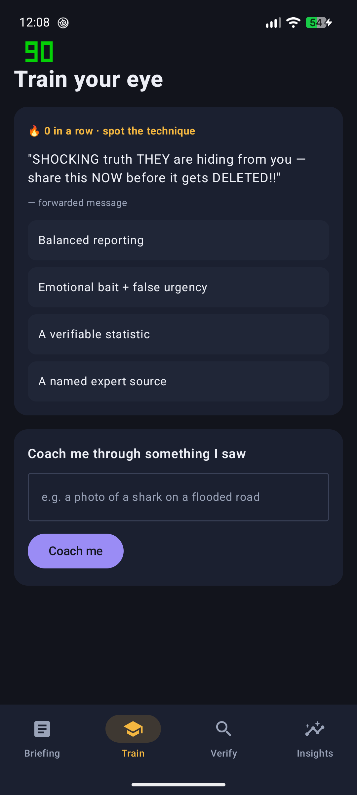

<div align="center">

# 🔎 Vera

### Your on-device media-literacy coach

**Vera turns the technology blamed for the misinformation crisis into the tutor that helps you think through it.**
A private, gamified news app whose AI runs **entirely on your phone** — it doesn't tell you what's true, it teaches you *how to find out*.

[](LICENSE)
[](#build--run)
[](#on-device-ai)


Built for the **UNESCO Youth Hackathon 2026** · *"Play Your Part: Youth Designing the Future of Media & Information Literacy"*

</div>

---

## Install

Vera is distributed as **open-source** software. It's being published on **[IzzyOnDroid](https://apt.izzysoft.de/fdroid/)** (an F-Droid-compatible repo, installable from the F-Droid app) — see **[docs/DISTRIBUTION.md](docs/DISTRIBUTION.md)**. You can also [build it from source](#build--run) or grab the APK from [Releases](https://github.com/swaggpi/Vera/releases).

## Why Vera

Generative AI has made convincing falsehoods effortless to produce. The usual defence — verdict-style fact-checkers — can't keep pace, teaches *dependence* instead of *skill*, and rarely reaches people privately or offline. Vera flips this: a small language model runs **locally on your device** to build your own judgement — nothing is uploaded, it works offline after setup, and it costs nothing to run.

## Features

| | |
|---|---|
| 📰 **Gamified briefing** | Morning & evening news from sources *you* choose across the world's largest countries. The on-device model writes a plain-language summary; each card shows the outlet's **ownership** and **political leaning**, with streaks & XP. |
| 🧠 **Key points + ask-anything chat** | "More details" pulls out the must-know facts, and a **full-screen view** lets you chat with Vera about the story — answers grounded strictly in the article, on-device. |
| 🕵️ **"Check what you heard"** | Say or type a claim → Vera searches **multiple outlets**, keeps a *diverse & relevant* set (not the first 5), summarises each, and flags likely bias — coaching you on how to weigh them. |
| 🎓 **Fake-news training** | A daily "spot the manipulation technique" game (prebunking) plus a SIFT Socratic coach for anything you've seen. |
| 📊 **News-diet meter** | Visualises how varied your sources are by country and ownership, and nudges you out of echo chambers. |

## Screenshots

<div align="center">

| Briefing | Key points | Story + chat |
|:---:|:---:|:---:|
|  |  |  |
| **One-tap AI install** | **Check what you heard** | **Train your eye** |
|  |  |  |

*Running on a Pixel 7a / GrapheneOS. The green digits are the phone's refresh-rate developer overlay, not part of the app.*

</div>

## On-device AI

Vera uses **MediaPipe LLM Inference** to run a small language model on the phone's own hardware.

- **One-tap install:** the app downloads the model itself (progress bar, no adb, no manual file copying) into its private storage and loads it — then real, private AI replaces the placeholder text.
- **Default model:** [`Qwen2.5-1.5B-Instruct`](https://huggingface.co/litert-community/Qwen2.5-1.5B-Instruct) (~1.6 GB) — **Apache-2.0 and ungated**, so it installs with no token and no licence step.
- **Gemma drop-in:** Google's Gemma is fully supported — it's licence-gated, so set a Hugging Face token + URL in [`ModelCatalog`](app/src/main/kotlin/app/vera/data/ModelManager.kt).
- **No Google Play Services required** → works on de-Googled ROMs like GrapheneOS.

> Everything the model, network, voice and search touch sits behind an interface with a fake implementation, so the whole app is unit-testable on the JVM without a model or device.

## Architecture

- **`:core`** — pure Kotlin/JVM: models, `LlmEngine`/`SpeechService`/`SearchProvider` interfaces + fakes, RSS/Atom parser, source catalog, briefing generator, SIFT coach, inoculation bank, research pipeline (relevance ranking + domain-diverse selection + bias directory), gamification (streaks/XP, SM-2 spaced repetition) and the news-diet meter. **All fast unit tests live here.**
- **`:app`** — Jetpack Compose (Material 3) UI, Hilt DI, Room, DataStore, WorkManager, OkHttp. Real device impls: `MediaPipeLlmEngine`, `AndroidSpeechService`, `DuckDuckGoSearchProvider` + `WikipediaSearchProvider`, `ModelManager`.

**Stack:** Kotlin · Jetpack Compose · Hilt · Room · Coroutines/Flow · MediaPipe GenAI · OkHttp · minSdk 26 / targetSdk 35.

## Build & run

```bash
bash init.sh            # installs the Android SDK on first run, writes local.properties
bash run-tests.sh       # unit tests + assembleDebug  (no device or model needed)
```

Install on a device (see [`DEVICE-TESTING.md`](DEVICE-TESTING.md) for wireless-ADB details):

```bash
./gradlew installDebug
# or: adb install -r app/build/outputs/apk/debug/app-debug.apk
```

Then open Vera and tap **Download Vera's brain** once to enable real on-device AI.

## Roadmap

- [ ] GPU inference backend + cache generated briefings (Room) for instant open
- [ ] WorkManager twice-daily briefing generation + notifications
- [ ] Runtime mic-permission flow; FOSS on-device voice (whisper.cpp) for fully de-Googled speech
- [ ] Brave/Tavily search providers (API key) for stronger news-claim recall
- [ ] Deepfake / AI-image spotting drills; share-back explainer cards
- [ ] Community discourse layer (opt-in, moderated)

## Media & information literacy foundations

- **SIFT** (Stop · Investigate the source · Find better coverage · Trace) — Mike Caulfield
- **Lateral reading** — Stanford History Education Group
- **Psychological inoculation / prebunking** — Roozenbeek & van der Linden
- **UNESCO** Media & Information Literacy framework

> Outlet leaning/bias labels are approximate and for reflection — a prompt to weigh perspective, never a definitive rating.

## Contributing

Issues and PRs welcome. Run `bash run-tests.sh` before submitting — green unit tests are the bar. See [`feature-requirements.md`](feature-requirements.md) for the backlog and [`progress.txt`](progress.txt) for current state.

## Licence

**[GNU GPL v3.0](LICENSE)** © 2026 swaggpi. Vera is free and open source — you may use, study, modify and
share it, but **any distributed or modified version must also be open-sourced under the GPL**.

**Commercial use:** if you want to use Vera (or a derivative) in a proprietary/closed product without the
GPL's copyleft obligations, a separate **commercial licence is available** — contact the author. (The bundled
default model, Qwen2.5, is Apache-2.0; Wikipedia/DuckDuckGo are used for search.)
